<svg fill="none" viewBox="0 0 120 120" width="120" height="120" xmlns="http://www.w3.org/2000/svg">
  <foreignObject width="100%" height="100%">
 
        
            
            

                <h1>Progetto d'esame Computer Graphics</h1>
                
Andrea Ferrari matr. 0000901734

                <label style="position: absolute;right: 25%;
                font-size: 2vmin;">Anno 2020</label>
                 
                <h2 >                    
                    <a name="descrizione">Descrizione del gioco</a>
                </h2>
                

                    Il gioco realizzato consiste in un arcade di corse a bordo di una Toyota gt86,
                    in una localit&#224; di montagna,
                    &#232; un single player a punteggio con due modalit&#224;: 'Race' e 'Drift'.
                    Si hanno a disposizione 2 minuti per accumulare i punti, il gioco parte col primo comando che l'auto riceve.
                    A seconda della modalit&#224; cambia lo stile di guida e il metodo di calcolo del punteggio:
                    Modalit&#224; Drift: l'auto ha meno aderenza facilitando la derapata (o drift), lo scopo &#232; dunque una guida "spettacolare"
                    e i punti vengono aggiunti in base all'angolo di sterzata della macchina,
                     la difficolt&#224; sta nel eseguire le derapata senza uscire di strada.
                    Modalit&#224; Race: l'auto &#232; molto pi&#249; stabile, ma &#232; necessario un maggior dosaggio dell'acceleratore per poter rimanere in strada,
                    il punteggio aumenta con l'aumentare della velocit&#224; dell'auto.
                    In entrambe le modalit&#224; &#232; presente una penalit&#224; se si esce di strada, la penalit&#224; &#232; suddivisa in 3 fasce (gialla, arancione e rossa)
                    a seconda del tempo fuori strada, maggiore &#232; il tempo maggior&#232; sar&#224; la penalit&#224;.
                

                <h2>
                   <a name="comandi">Comandi del gioco</a>
                </h2>
                
    
                    Il gioco ha due tipi di visuale: 'libera' e 'dinamica', la prima guarda il centro mappa
                    con la possibilit&#224; di ruotare e ingrandire, la seconda &#232; fissa sulla macchina.  
                    Comandi da tastiera: W, A, S, D e barra spaziatrice per il freno a mano.
                    Comandi del mouse: se la visuale di gioco &#232; in modalit&#224; 'libera' si pu&#242; ruotare tramite il click e lo spostamento con il mouse, 
                    ci si pu&#242; avvicinare o allontanare al centro mappa con la rotella del mouse.        
                    Il gioco &#232; fruibile anche su mobile tramite il touch (swipe sullo schermo per gestire la direzzione dell'auto).                    
                    Se si cambia modalit&#224; durante una partita, il gioco si resetta, come allo scadere del tempo.    
                    Sulla sinistra c'&#232; il tabellone dei punti e una pulsantiera con i comandi per la camera e la gestione di alcuni filtri (frustum, specchio, modalit&#224; di gioco e illuminazione).
                

                <h2>
                    <a name="intro">Introduzione</a>
                </h2>
                
   
                    I punti che seguono descrivono come &#232; stato sviluppato il progetto, cercando di seguire l'ordine cronologico di sviluppo delle feature principali.
                    Verranno brevemente spiegate alcune scelte effettuate e meccanismi particolari.
                

                <h2>
                    <a name="strut">Prima fase: strutture principali</a>
                </h2>
                
   
                  Come prima cosa sono state create delle strutture js in modo tale da poter iniziare a lavorare con gli oggetti 3D caricati da file obj o generati da codice,
                  lavorare con gli shader e con il canvas.
                  Queste strutture hanno subito molteplici variazioni lungo lo sviluppo del progetto, il risultato finale sono i file 'Obj3D', 'Panel2D' ed 'WebGLController'.
                  Obj3D corrisponde ai dati di un singolo file obj con le funzioni di lettura e conversione dei dati, trasformazioni geometriche e alcune utility,
                  si basa principalmente sulle risorse 'm4', 'webgl-utils', 'primitives' e 'glm-light'.
                  Panel2D e WebGLController sono le strutture che gestiscono i 2 canvas, rispettivamente quello dedicato al pannello di controllo in html5 e quello del gioco vero e proprio
                  in tecnologia webgl.
                  In particolare WebGLController controlla tutti gli oggetti 3D della scena e il render, che in alcune parti viene delegato ai singoli Obj3D o a strutture esterne.
                  La risorsa 'glm-light' &#232; stata leggermente estesa per poter leggere dai file anche le normali e le coordinate 2D per le eventuali texture.
                  Il risultato di questa fase &#232; un terreno di prova con la possibilit&#224; di gestire in modo agevole oggetti 3D, luci, sfumature, ombre e la view.
                

                <h2>
                    <a name="vettura1">Seconda fase: prima texture (abbozzo della vettura)</a>
                </h2>          
                <table style="table-layout: fixed;width:95%; margin-left: 2.5%;">
                    <tr >
                        <td style="width:50%">
                            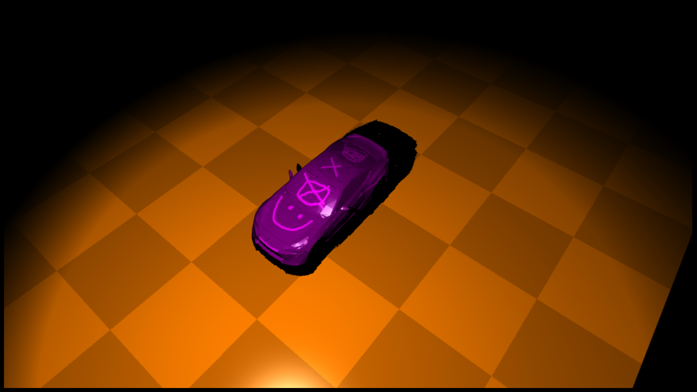</img>       
                        </td>
                        <td style="width:50%">
                            
   
                                Prendendo un 3D gi&#224; strutturato di una gt86, è stata eseguita una pulizia eliminando tutti i sotto elementi indesiderati
                                (interni, ruote, dettagli, elementi ripetuti, ecc.), eseguito delle booleanee per poter rendere i sotto elementi un oggetto 3D singolo,
                                corretto le normali e applicata una riduzione significativa del numero dei poligoni.
                                Per finire si è lavorato sulla texture della vettura.
                            
   
                        </td>                   
                      </tr>
                </table>
                <h2>
                    <a name="vettura2">Terza fase: Vettura con texture finale e qualche utility</a>
                </h2>          
                <table style="table-layout: fixed;width:95%; margin-left: 2.5%;">
                    <tr >
                        <td style="width:50%">
                            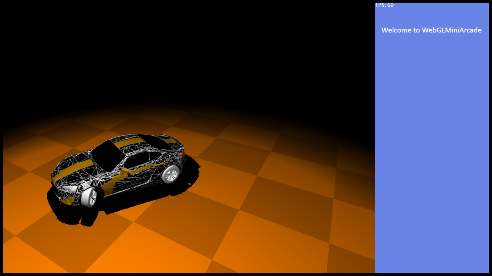</img>       
                        </td>
                        <td style="width:50%">
                            
   
                               Viene qui realizzata l'ultima texture per l'auto, colorando i vetri, i fari e disegnando qualche aerografia.
                               Evidenziando sulla texture le linee, dei vari triangoli che compongono la scocca della macchina, di bianco
                               otteniamo una verniciatura originale e nascondiamo (mettendo in bella vista) i poligoni della macchina.
                               Le ruote sono state trattate esattamente come la scocca della macchina (ripulitura, unione, ecc.),
                               l'oggetto che rappresenta la ruota &#232; uno solo e ne viene fatto il render quattro volte con annesse trasformazioni geometriche.
                               In questa fase sono state realizzate molte utility tra cui il contatore FPS visualizzato nel pannello di sinistra e il
                               limitatore (fissato a 60FPS), la logica per i movimenti dell'auto, i comandi da tastiera, da mouse e touch-screen.
                            
   
                        </td>                   
                      </tr>
                </table>
                <h2>
                    <a name="luciombre">Quarta fase: luci e ombre (fari dell'auto)</a>
                </h2>          
                
   
                    In questa fase sono state apportate modifiche importanti sugli shader, per poter gestire
                    le due luci anteriori della macchina e le loro ombre (oltre a quella del "mondo").
                    Partendo da una luce soltanto e un cubo di prova per vederne la proiezione dell'ombra, si &#232; arrivati a gestire
                    le due luci che proiettano al suolo, le loro ombre e altre due luci che proiettano verso i fari anteriori e posteriori (simulando la luce al suo interno).
                    In totale nello shader sono gestite (in questa fase) sette luci, una per il mondo e sei per la vettura.
                    Le luci posteriori sono state gestite in modo da poterne cambiare l'intensit&#224; per poter simulare la luce di frenata
                    (si attiva sia in frenata normale, che in retromarcia e con il freno a mano).
                    Come si pu&#242; vedere dalle foto seguenti, le luci proiettate al suolo erano "dure" (nette),
                    apportando qualche modifica allo shader sono state "ammorbidite", tramite il calcolo di un parametro aggiuntivo "smorzatore_luce"
                    che agisce in base alla distanza dai bordi del frustum e alla relazione delle luci tra loro.
                
   
                <table style="table-layout: fixed;width:95%; margin-left: 2.5%;">
                    <tr >
                        <td style="width:50%">
                            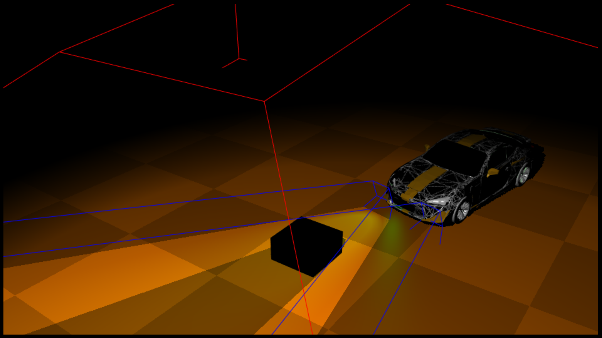</img>       
                        </td>
                        <td style="width:50%">
                            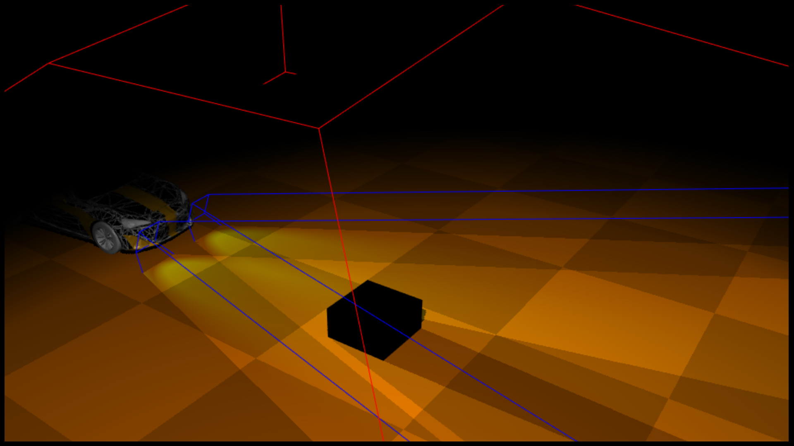</img>       
                        </td>        
                    </tr>
                    <tr >
                        <td style="width:50%">
                            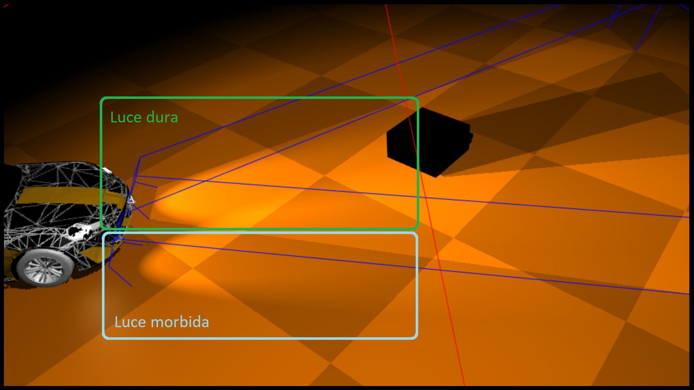</img>       
                        </td>
                        <td style="width:50%">
                            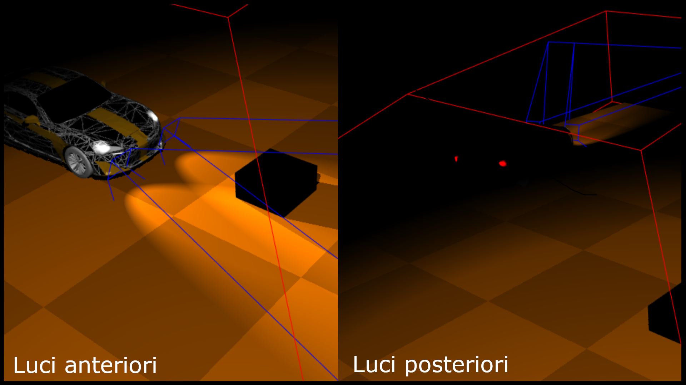</img>       
                        </td>        
                    </tr>
                </table>
                <h2>
                    <a name="specchio">Quinta fase: superficie riflettente (stencil buffer)</a>
                </h2>         
                <table style="table-layout: fixed;width:95%; margin-left: 2.5%;">
                    <tr >
                        <td style="width:50%">
                            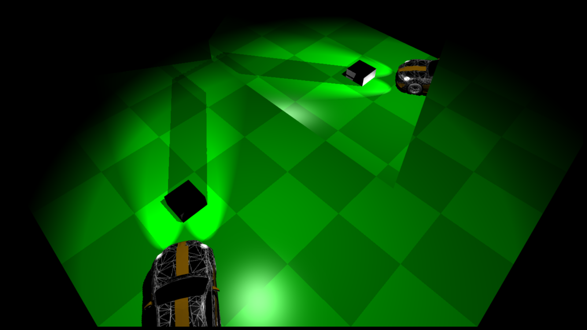</img>       
                        </td>
                        <td style="width:50%">
                            
   
                                L'idea di partenza era quella di realizzare una vetrina in cui far specchiare l'auto, quindi una superficie riflettente che poi verr&#224; incorporata in un edificio.
                                Per realizzare lo specchio, &#232; stato utilizzato lo stencil buffer, delimitando la sua regione con un rettangolo.
                                Il "mondo dentro lo specchio" &#232; stato riflesso invertendo sia la matrice di vista 'u_view' che quella del mondo 'u_word' con la matrice 'specchioMatrix' (che effettua l'operazione di scale per -1), 
                                anche la camera viene ruotata di 180&#176; orizzontalmente.
                                Per ottenere una specchiatura realistica, il draw della scena nel mondo dentro lo specchio, preserva anche le luci e le ombre, in particolar modo le ombre vengono in realt&#224; calcolate una sola volta 
                                (mondo all'esterno dello specchio) e poi riutilizzate per la draw nella zona dello stencil buffer che rappresenta lo specchio.
                                La rotazione della camera per poter disegnare dentro lo specchio, comporta una problematica: tutti gli oggetti che si trovano dietro lo specchio potrebbero essere catturati dalla draw
                                effettuata proprio per disegnare il mondo dentro lo specchio, questo perch&#232; un oggetto di scena potrebbe ritrovarsi tra il punto di vista ruotato di 180 gradi e la posizione dello specchio.
                                La soluzione adottata &#232; stata quella di aggiungere una propriet&#224; che stabilisce se l'oggetto di scena &#232; posto dietro allo specchio e in quel caso la draw inerente ignorer&#224; l'oggetto, non disegnandolo.
                                Per questo progetto, la strategia funziona perfettamente, dato che gli oggetti di scena sono tutti fermi eccetto la vettura, che in entrambe le due modalit&#224; di camera (libera e dinamica) non &#232; mai affetta dal problema.
                                Infine &#232; stata ridotta la luminosit&#224; all'interno dello specchio per rendere lo specchio pi&#249; simile ad una vetrina.
                                Nella foto qui a sinistra, si pu&#242; notare la differenza nell'applicare o meno la matrice 'specchioMatrix', in questo esempio non &#232; stata applicata all'oggetto che forma il pavimento, infatti non viene riflesso correttamente nello specchio.
                            
        
                        </td>        
                    </tr>     
                </table> 
                <h2>
                    <a name="mondo">Sesta fase: traciato (B&#233;zier) e skybox</a>
                </h2>         
                
   
                   Oltre alla classe 'Obj3D', per leggere ed utilizzare file.obj generici e alla classe 'Car' che contiene pi&#249; 'Obj3D' e tutta la logica della vettura,
                   in questa fase sono state realizzate le classi 'Mondo' e 'Pista' che sono rispettivamente la Skybox e il tracciato generato da delle curve di B&#233;zier.
                   La prima pista &#232; stata realizzata da due curve di B&#233;zier di grado 3, la prima scalata rispetto alla seconda che rispettivamente rappresentano il margine interno ed esterno del tracciato.
                   Vengono tramite queste due curve generati dei triangoli, collegando ogni punto della linea interna con il rispettivo e il successivo di quella esterna e viceversa.
                   Alla fine per disegnare un tracciato pi&#249; coinvolgente, sono state utilizzate 6 coppie di curve di B&#233;zier di grado 3, in modo da poter disegnare pi&#249; curve (la continuit&#224; delle curve &#232; stata rispettata).
                   In questa fase sono stati aggiunti i primi due oggetti di scena (il negozio e una luce da campo), sono state aggiunte le texture alla skybox ed &#232; stata implementata la modalit&#224; 'dinamica' della camera.
                   Per quanto riguarda il pannello di controllo sulla sinistra, &#232; stata creata la pulsantiera, che in modo dinamico consente di riempire lo spazio a disposizione con i pulsanti necessari,
                   effettuandone un resize se necessario.                                      
                
   
                <table style="table-layout: fixed;width:95%; margin-left: 2.5%;">
                    <tr >
                        <td style="width:50%">
                            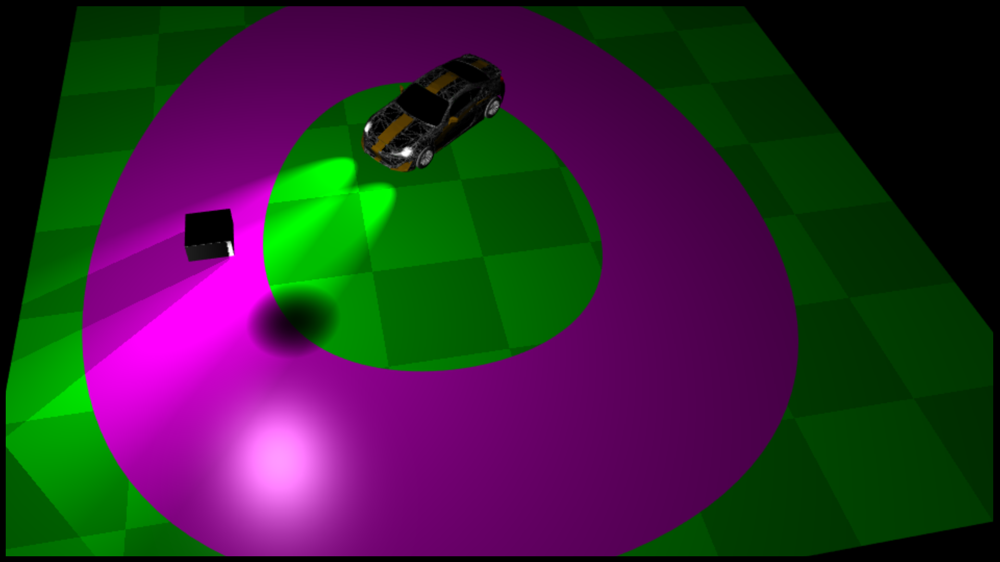</img>       
                        </td> 
                        <td style="width:50%">
                            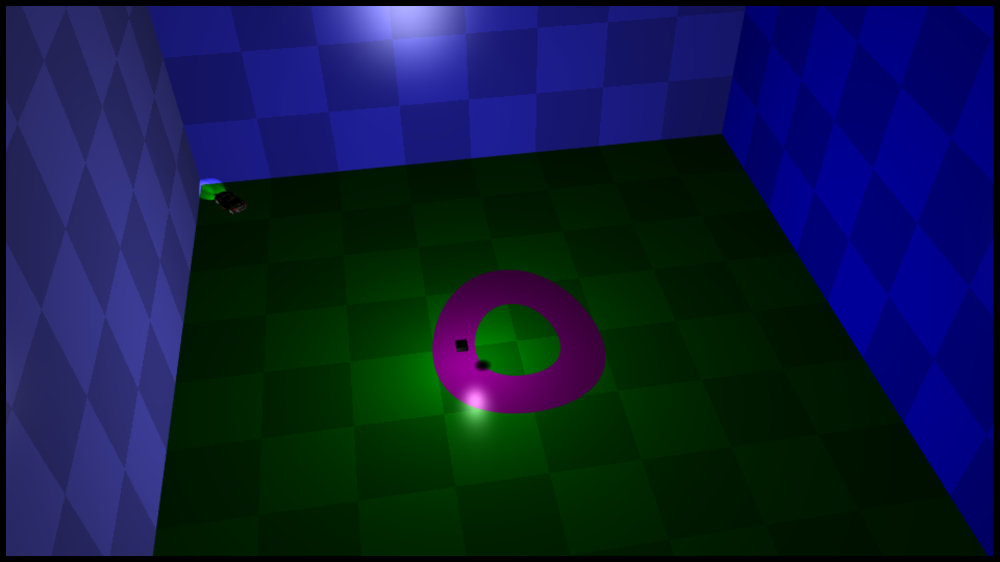</img>       
                        </td>      
                    </tr>     
                </table>
                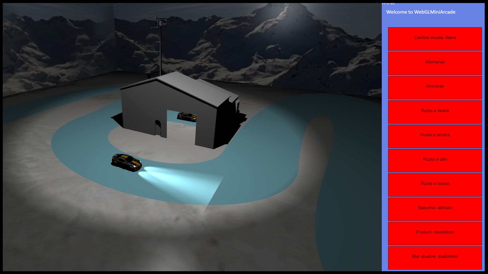</img>     
                
                <h2>
                    <a name="objs">Settima fase: oggetti di scena e luci</a>
                </h2>         
                <table style="table-layout: fixed;width:95%; margin-left: 2.5%;">
                    <tr >
                        <td style="width:50%">
                            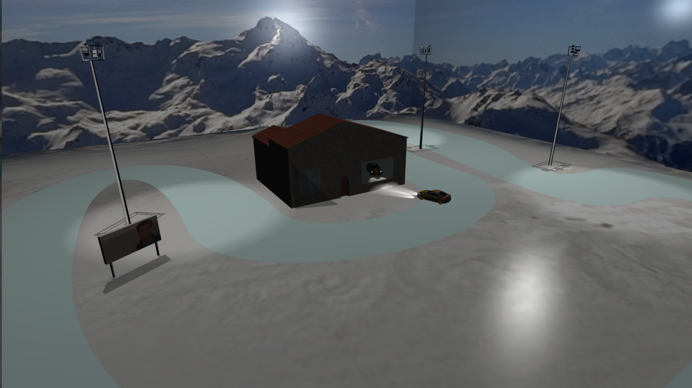</img>       
                        </td>
                        <td style="width:50%">
                            
   
                              Vengono gestite in totale 3 luci per il mondo (oltre le 6 del veicolo), ogni luce &#232; fissa su un oggetto di scena che rappresenta una luce da campo.
                              Sono state aggiunte le texture al negozio, in modo da risaltarne il tetto, la porta e aggiungere una finestra chiusa.
                              Per finire &#232; stato aggiunto il cartellone con la mia foto.
                            
        
                        </td>        
                    </tr>     
                </table> 
                 
                <h2>
                    <a name="mod">Ottava fase: modalit&#224; e dettagli</a>
                </h2>     
                
   
                    Aggiunte le modalit&#224; Race e Drift, con relative modifiche ai parametri di guida dell'auto e alla logica dei punteggi.
                    Aggiunto il "fuori pista", generando delle funzioni di vincoli in x e y per sapere se l'auto &#232; all'interno del tracciato o all'esterno.
                    Aggiunta la logica per simulare uno scontro (rimbalzo) contro gli oggetti di scena, sempre tramite funzioni di vincoli calcolate sui singoli oggetti di scena e sullo Skybox,
                    si pu&#242; riconoscere con un margine di errore accettabile se il veicolo si sta scontrando contro un'oggetto di scena e nel caso la sua velocit&#224; viene riflessa in modo da simulare lo scontro.
                    Come particolarit&#224; sono stati aggiunti due oggetti di scena, che seguono il veicolo e che indicano uno il "fuori pista" e l'altro lo scontro contro un oggetto.
                    Il primo risiede sulla destra posteriore della vettura, appare se si &#232; fuori pista, cambia colore a seconda del tempo trascorso fuori pista (giallo, arancione e rosso) ed &#232; animato.
                    Il secondo invece non &#232; animato n&#233; cambia colore e risiede sulla sinistra posteriore della vettura, appare allo scontro contro un oggetto e scompare quando l'auto smette di essere influenzata 
                    dallo scontro.                    
                
       
                <table style="table-layout: fixed;width:95%; margin-left: 2.5%;">
                    <tr >
                        <td style="width:50%">
                            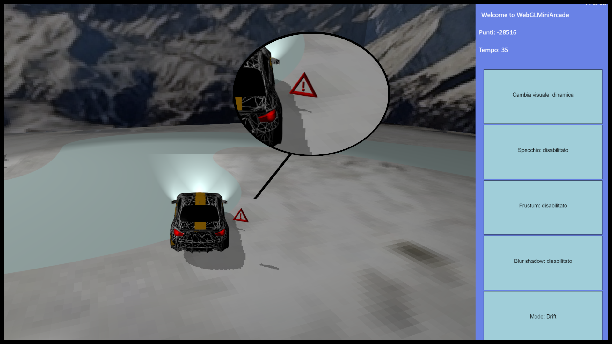</img>       
                        </td>
                        <td style="width:50%">                                
                            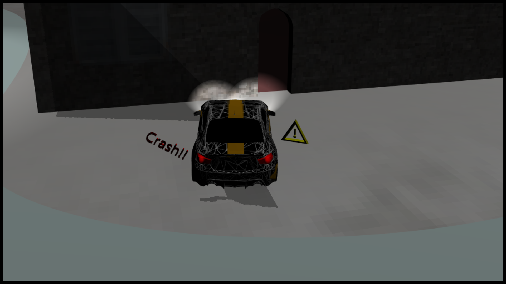</img>    
                        </td>        
                    </tr>     
                </table>
                <h2>
                    <a name="softshadow">Soft shadow</a>
                </h2>     
                 <!-- 
       ò->&#242; 
       ù->&#249; 
       à->&#224; 
       è->&#232; 
       é->&#233; 
       ì->&#236;
    -->
                
   
                 Sperimentando i vari metodi per generare delle soft shadow, ci si &#232; concentrati nel calcolare un blur delle ombre all'interno del fragment shader.
                 Inizialmente aggiungendo un semplice effetto di "rumore" sugli estremi dell'ombra proiettata, ma questo non ha dato alcun risultato soddisfacente.
                 Per poi orientarci verso la tecnica di simulare un area di luce con pi&#249; sorgenti puntiforme, senza per&#242; effettivamente
                 definire pi&#249; sorgenti luminose e calcolarne la shadow map. Il numero delle sorgenti di luce rimane invariato,
                 e su ogni shadow map viene effettuato un ciclo in cui l'ombra viene ruotata di circa 1 grado in senso orario e antiorario,
                 in modo da poter proiettare pi&#249; volte la stessa ombra in moto rotatorio ammorbidendone cos&#236; i lati frastagliati.
                
       
                <table style="table-layout: fixed;width:95%; margin-left: 2.5%;">
                    <tr >
                        <td style="width:50%">
                            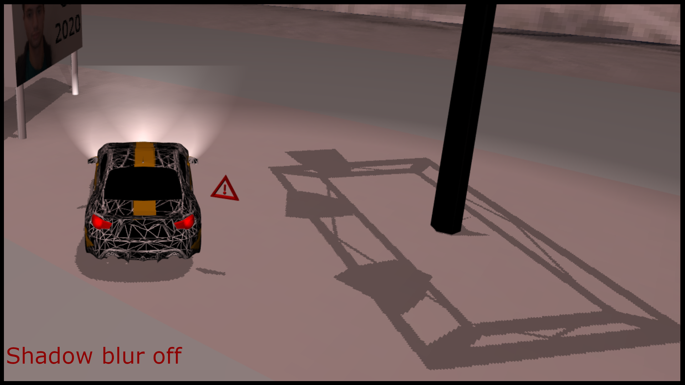</img>       
                        </td>
                        <td style="width:50%">                                
                            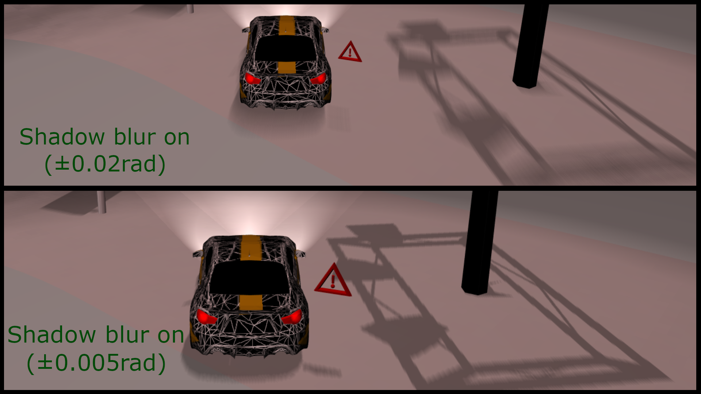</img>    
                        </td>        
                    </tr>     
                </table>                 
                <h2>
                    <a name="conc">Conclusioni</a>
                </h2>     
                
   
                    Il progetto &#232; stato testato anche su un dispositivo modile a basse prestazioni, &#232; fruibile nel range 18-25fps, l'abilitare o disattivare lo specchio incide relativamente poco, mentre
                    &#232; stata notata una significativa perdita di fps con l'introduzione delle sorgenti multiple di luce e relative ombre.
                    Sempre sul dispositivo mobile, con la funzionalit&#224; "blur shadow" disabilitata si contano mediamente 20fps, con la modalit&#224; attivata si scende a 9fps.
                    File del progetto:
                    Sotto la cartella 'lib' ci sono tutti gli script realizzati.                     
                 
      
                 <ul style="margin-left:2vw;                
                 margin-right:2vw;                
                 margin-top:0.2vw;                             
                 margin-bottom:0.2vw;
                 font-size: 2vmin;">
                    <li>
                        'Car.js' contiene tutte le funzionalit&#224; del veicolo, comprese le sue luci, la logica dei punteggi, la gestione della tastiera e del touch-screen.                          
                    </li>     
                    <li>                        
                       'Mondo.js' &#232; la skybox, la sua particolarit&#224; sta nel metodo 'getBound' che permette di ottenere una funzione che date le coordinate xy restituisce 'true' se sono all'interno della skybox.
                   </li>                         
            
                   <li>                        
                    'Obj3D.js' gestisce un singolo oggetto 3D caricadolo dall'esterno, con eventualmente la sua bitmap come texture, possiede anche il metodo 'getBound' che restituisce una funzione date le cordinate xy &#232; 'true' se sono all'esterno di un approssimazione del modello 3D.
                   </li>  
                   <li>                        
                    'Pista.js' rappresenta e genera l'oggetto 3D del tracciato.
                   </li>  
                   <li>                        
                    'Panel2D.js' controlla il canvas sulla destra in grado di gestire gli eventi del mouse, &#232; il pannello di controllo con la pulsantiera, interagisce con 'WebGLController.js' e con 'Car.js' per modificarne i parametri.
                   </li>                       
                   <li>                        
                    'WebGLController.js' contiene la logica principale per disegnare gli oggetti di scena, lo specchio e le luci, controlla il canvas sulla sinistra.
                   </li>   
                   <li>                        
                    'GameBehavior.js' &#232; solo una classe che aiuta 'Car.js' a comunicare con 'Panel2D.js'.
                   </li>   
                   <li>                        
                    'Ombre.js' contiene le funzioni per la gestione delle ombre, utilizzate da 'WebGLController.js'.
                   </li> 
                    <li>                        
                    'utility.js' contiene delle funzioni di utility.
                   </li> 
                </ul>     
                 

                    Sotto la cartella 'resources' ci sono le librerie del corso utilizzate.
                

             
           
         
         
                

       
            

                

                    <h1>Indice</h1>
                    <ul style="margin-left:1.5vw;font-size: 1.5vmin;">
                        <li>
                            <a href="#descrizione">Descrizione del gioco</a>
                        </li>    
                        <li>                        
                             <a href="#comandi">Comandi di gioco</a>
                        </li>    
                        <li>                        
                            <a href="#intro">Introduzione</a>
                       </li>   
                       <li>                        
                            <a href="#strut">Strutture principali</a>
                       </li>   
                       <li>                        
                            <a href="#vettura1">Vettura e prima texture</a>
                       </li> 
                       <li>                        
                            <a href="#vettura2">Vettura e texture finale</a>
                       </li>
                       <li>                        
                            <a href="#luciombre">Luci e ombre</a>
                       </li> 
                       <li>                        
                        <a href="#specchio">Superficie riflettente</a>
                       </li>         
                       <li>                        
                            <a href="#mondo">Tracciato e skybox</a>
                       </li>     
                       <li>                        
                           <a href="#objs">Oggetti di scena</a>
                       </li>  
                       <li>                        
                            <a href="#mod">Modalit&#224; e dettagli</a>
                       </li>       
                       <li>                        
                         <a href="#softshadow">Soft shadow</a>
                       </li>       
                       <li>                        
                          <a href="#conc">Conclusioni</a>
                       </li>              
                    </ul>            
                

                   
            

        
     
  </foreignObject>
</svg>
